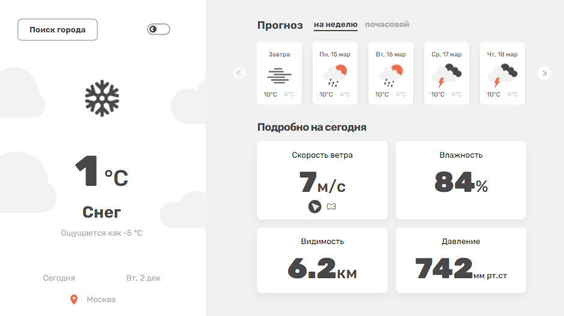
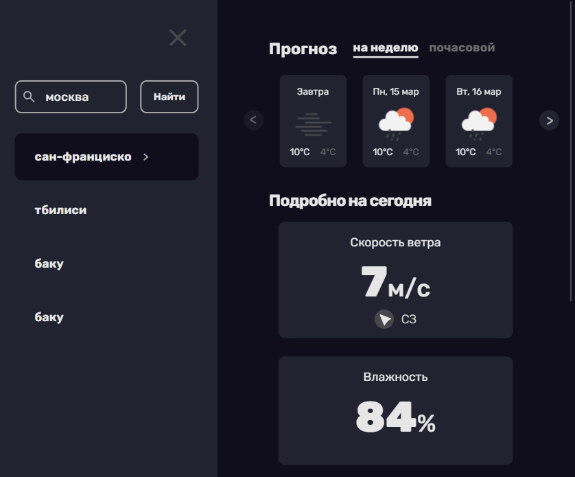
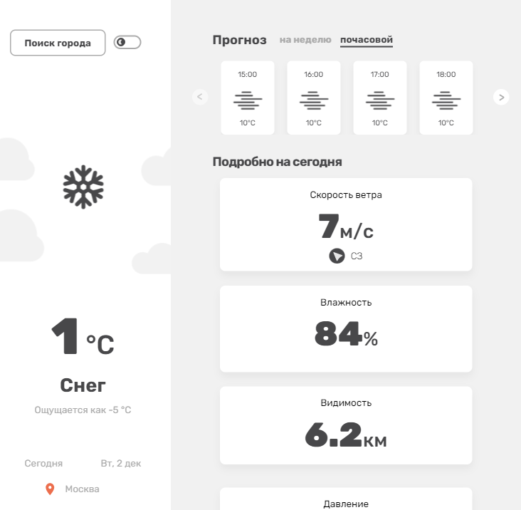
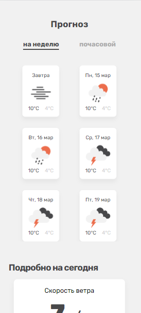

# Weather App
ReactJS project with dark and white theme, responsive for mobile, tablet, and desktop view.

Link to the deployment: https://weather-app-sage-mu.vercel.app/

---

  <h3 style="font-size: 18px;">Desktop view</h3>
  

  

    <h3 style="font-size: 18px;">Tablet view</h3>
    
    
  

  

    <h3 style="font-size: 18px;">Mobile view</h3>
    
  

